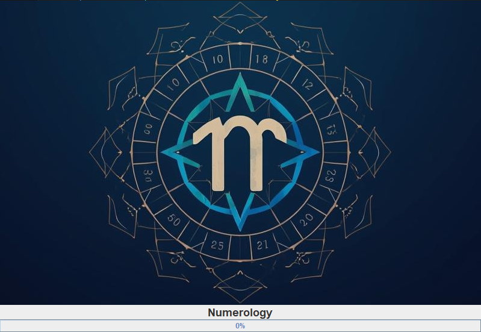
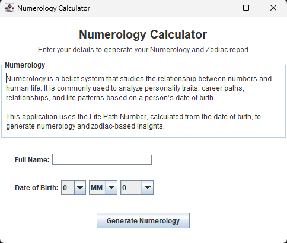
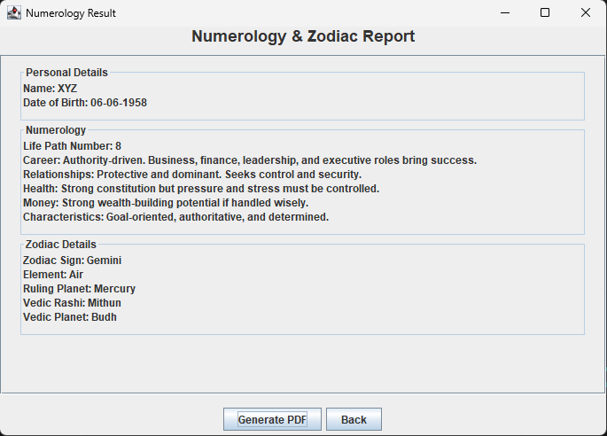

# Numerology Application

**Java Swing-based desktop numerology tool for calculating core numerology numbers**  
This application computes a user’s **Life Path Number** based on their **name** and **date of birth (DOB)**. It is built using **Java and Swing GUI** for a lightweight, cross-platform desktop experience.

---

## 🚀 Project Overview

Numerology is an ancient system of interpretation that assigns meaning to numbers derived from letters and dates. This application makes numerology accessible by computing the **Life Path Number** — one of the most foundational values in numerological analysis — from simple user inputs.

**Goal:** Provide a standalone desktop utility that:
- Accepts a user’s name and date of birth
- Calculates their Life Path Number
- Displays numerological results in a clear graphical interface

**Platform:** Desktop (Windows / macOS / Linux)  
**Technology:** Java (Swing) GUI

---

## ⭐ Key Features

- 🎯 **Life Path Number Calculation**
  - Computes the most significant numerology number from DOB and name
  - Uses standard numerology reduction methods (Pythagorean system)

- 🖥️ **Graphical User Interface**
  - Simple form-based UI built with Java Swing components
  - Responsive layout for ease of use

- 📝 **Input Validation**
  - Checks format of date of birth
  - Ensures name is entered properly before computing results

---

## 📦 Installation & Requirements

### System Requirements

| Requirement      | Version / Notes          |
|-----------------|---------------------------|
| Java            | JDK 11 or newer           |
| GUI Framework   | Built-in Java Swing       |
| Operating System| Any OS with Java support  |

---

## 📸 Screenshots

### Splash Screen

### Input Screen

### Result Screen

